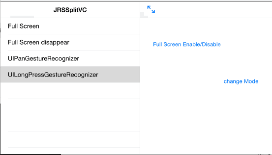
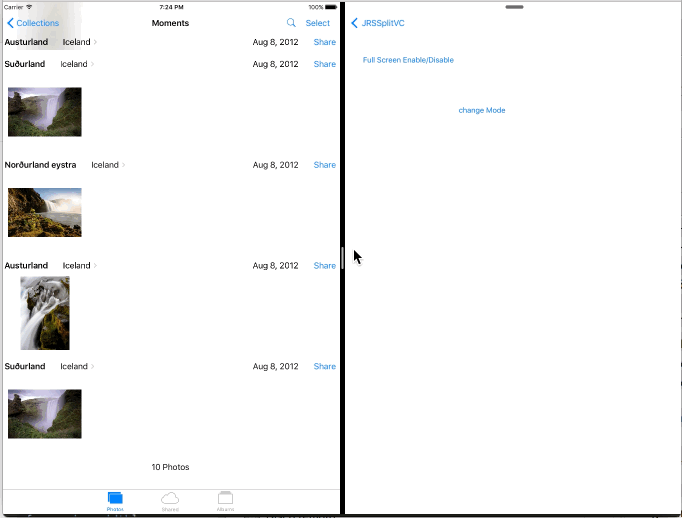

# JRSplitVC



[](https://travis-ci.org/José Roldán Jiménez/JRSplitVC)
[](http://cocoapods.org/pods/JRSplitVC)
[](http://cocoapods.org/pods/JRSplitVC)
[](http://cocoapods.org/pods/JRSplitVC)

## Usage

To run the example project, clone the repo, and run `pod install` from the Example directory first.

### new customview on collapseview
Custom primary view

``` Objective-C
    self.primaryViewControllerCollapsed = @"MyCustonViewCollapse";
    self.primaryViewControllerExpand = @"MyMasterViewStorybard";
    self.storyboardFile = @"MyStoryBoardFile";
```

## Installation

JRSplitVC is available through [CocoaPods](http://cocoapods.org). To install
it, simply add the following line to your Podfile:

```ruby
pod "JRSplitVC"
```

## Author

José Roldán Jiménez, nosoycomplicao@gmail.com

## License

JRSplitVC is available under the MIT license. See the LICENSE file for more info.
